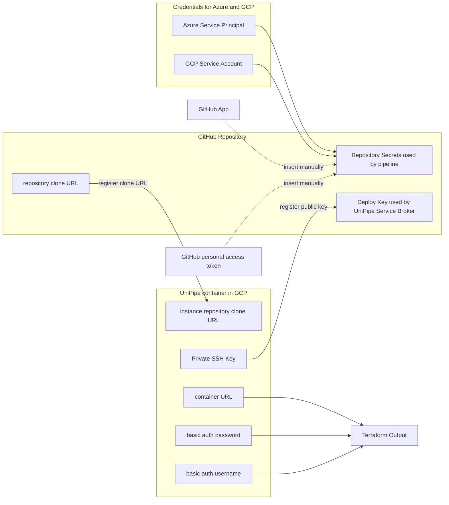

# How to deploy devops-toolchain-services

1. Provide github authentication; for example by setting the env variable GITHUB_TOKEN. 
2. Apply the terraform in this directory.
3. Create a repository secret `WORKFLOW_TOKEN` that holds a personal access token with the permissions `repo`, `workflow`, `admin:org`. This token is used by the main pipeline: 
5. Create a GitHub App with read and write permissions on `Administration`, `Contents`, `Secrets`, `Workflows`.
6. Install the App in your GitHub organization.
7. Create three repository secrets `GH_GITHUB_APP_ID`, `GH_GITHUB_APP_INSTALLATION_ID`, `GH_GITHUB_APP_PEM_FILE`.

Here is how the bits and pieces come together in this deployment:

